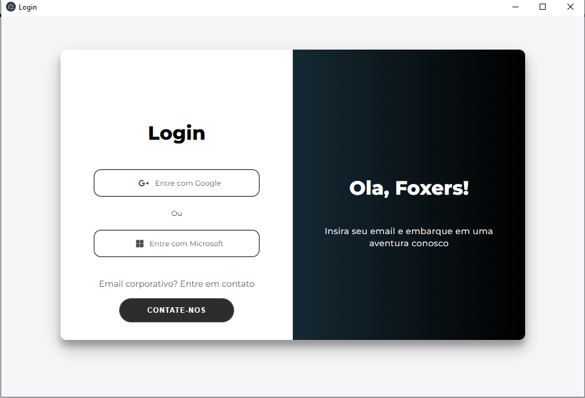
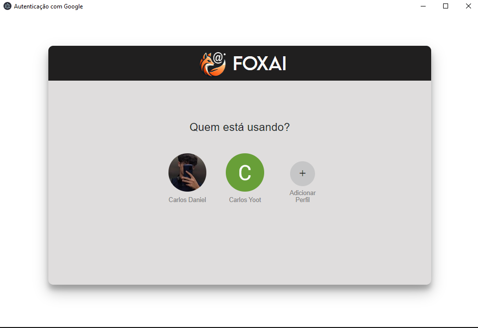

# FoxAi

  

# FoxAi - Gerenciamento Inteligente de Emails

**FoxAi** é um aplicativo de desktop em desenvolvimento que utiliza Inteligência Artificial para facilitar o gerenciamento de emails. Com ele, os usuários poderão organizar, responder e transformar emails em tarefas diárias de forma automática, otimizando o fluxo de trabalho e a produtividade.

Este projeto está sendo desenvolvido com **Electron**, utilizando a **API do Gmail** e recursos avançados de IA para oferecer uma experiência de gerenciamento de emails eficiente e personalizada. Embora ainda esteja em fase inicial, a meta é criar uma aplicação robusta que ajude usuários a automatizar tarefas repetitivas relacionadas a emails, além de responder a perguntas frequentes em tempo real.

> **Status do projeto**: Em desenvolvimento - 80%..  ⚙️

## Índice
1. [Sobre o Projeto](#sobre-o-projeto)
2. [Funcionalidades Planejadas](#funcionalidades-planejadas)
3. [Tecnologias Utilizadas](#tecnologias-utilizadas)
4. [Como Contribuir](#como-contribuir)
5. [Imagens](#previews)
5. [Autores](#autores)

## Sobre o Projeto
O **FoxAi** visa oferecer uma plataforma desktop inteligente de gerenciamento de emails com as seguintes funcionalidades:
- Organização automática de emails por categorias e prioridades.
- Transformação de emails importantes em tarefas diárias de forma automática.
- Respostas automáticas e assistidas por IA para emails comuns.
- Visualização em tempo real da caixa de entrada do usuário.
- Assistência de reconhecimento de voz.
  
Este aplicativo será uma excelente ferramenta para profissionais que lidam com alto volume de emails e precisam de respostas rápidas e organização eficiente. 

## Funcionalidades Planejadas

- **IA para Organização de Emails**: A IA categorizará emails automaticamente com base no conteúdo, remetente e prioridade.
- **Tarefas Automáticas a Partir de Emails**: Emails importantes poderão ser transformados automaticamente em tarefas, com prazos e lembretes configuráveis.
- **Respostas Inteligentes**: Sugestões de resposta automática com base em emails comuns, com possibilidade de customização pelo usuário.
- **Assistente de Dúvidas**: Um assistente de IA embutido responderá a dúvidas básicas sobre o uso do aplicativo ou consultas rápidas.
- **Visualização em Tempo Real**: Interface de visualização atualizada constantemente para monitorar novos emails.
- **Interface Intuitiva**: Navegação fácil e organizada com suporte a arrastar e soltar para organizar emails e tarefas.

## Tecnologias Utilizadas

- **Electron**: Para criação da aplicação desktop.
- **Node.js**: Para lidar com a lógica de back-end e gerenciamento de APIs.
- **API do Gmail (Google)**: Para acessar e manipular emails do usuário.
- **OAuth 2.0**: Autenticação segura para acesso à conta de email do usuário.
- **IA (Machine Learning)**: Classificação de emails e sugestão de respostas automáticas.
- **React**: Para componentes dinâmicos na interface.
- **SQLite**: Para armazenamento local de dados.
- **HTML5 e CSS**: Para construção da interface de usuário.

## Como Contribuir
Este projeto está em fase inicial, e contribuições são bem-vindas! Caso queira colaborar, siga os passos:
1. Realize um fork deste repositório.
2. Realize dicas e sugestões de melhorias atráves do pull request.
3. Selecione a label Suggestion
4. Envie o Pull Request explicando as sugestões.

## Previews
Abaixo segue algumas imagens do desenvolvimento da aplicação, bem como as funcionalidades

**LOGIN:**

  
  

**AVISOS**

As demais funcionalidades estão passando por uma triagem de informações e tratando da LGPD -  Lei Geral de Proteção de Dados Pessoais, para solicitar sua visualização entre em contato atráves de:

 [Entrar em contato](https://wa.me/5546991122966?text=Olá,%20gostaria%20de%20saber%20mais%20sobre%20seu%20projeto)

## Autores
- **Carlos Daniel** - Desenvolvedor Full Stack | [GitHub](https://github.com/Carlosyoot)

> **Nota**: Este projeto ainda não possui executáveis prontos para uso.
